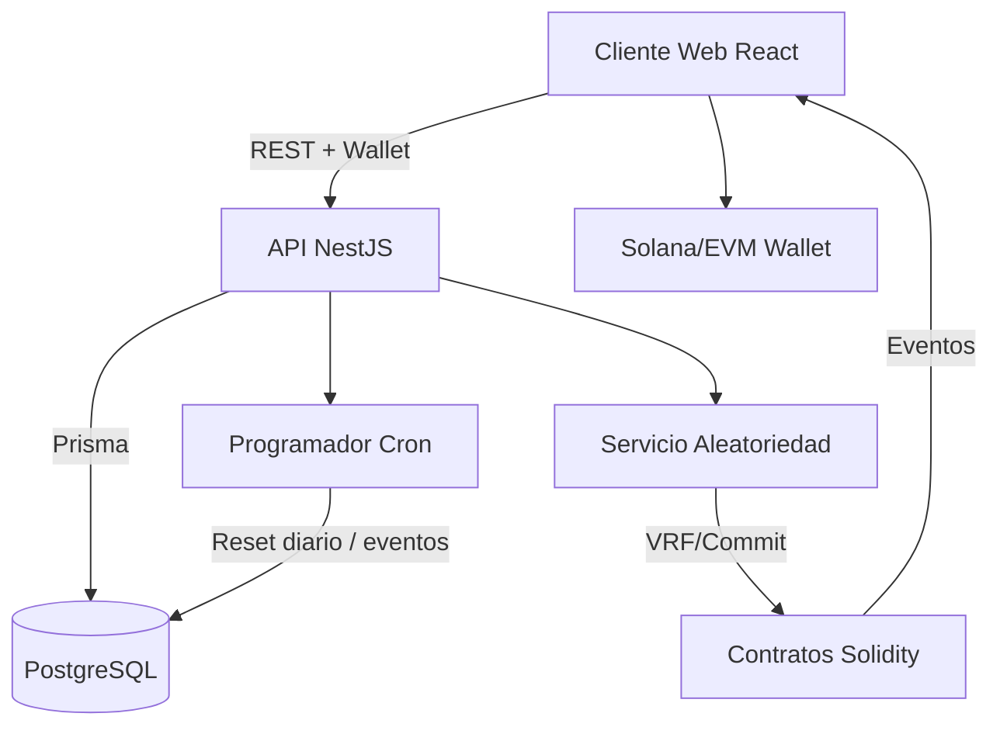
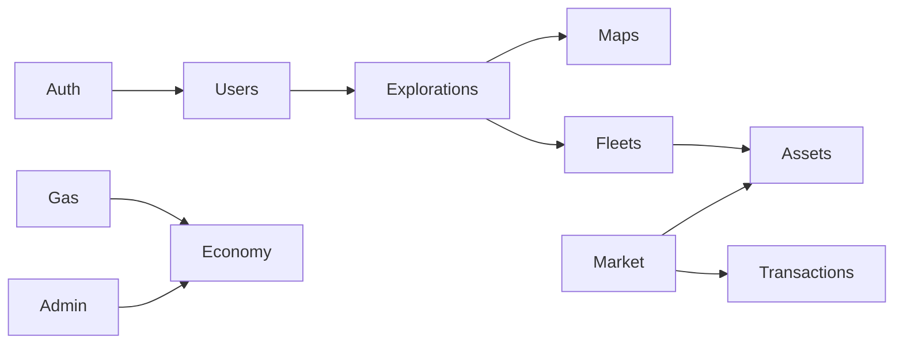

# Arquitectura Técnica — Neon Drifters

## Flujo principal

1. El jugador conecta su wallet desde el frontend.
2. La API verifica la firma (`/auth/wallet/verify`) y emite un JWT temporal.
3. Los módulos de exploración, mint y marketplace llaman a la base de datos y a los contratos para ejecutar acciones.
4. Cronjobs diarios renuevan turnos, rotan mapas y generan eventos dinámicos.
5. Los contratos administran GAS, NFTs y el escrow del marketplace.

## Módulos backend

## Contratos

- **GasToken** – ERC20 utilitario.
- **NFTShip** y **NFTWorker** – NFTs ERC721 con metadatos generativos.
- **Marketplace** – Escrow y listados P2P.
- **RandomnessCoordinator** – Integración con Chainlink VRF o commit–reveal.

## Consideraciones de despliegue

- Docker Compose recomendado para frontend, backend y base de datos.
- Variables de entorno en `.env.example` de cada paquete.
- Pipelines CI/CD con pruebas unitarias, lint y build.
